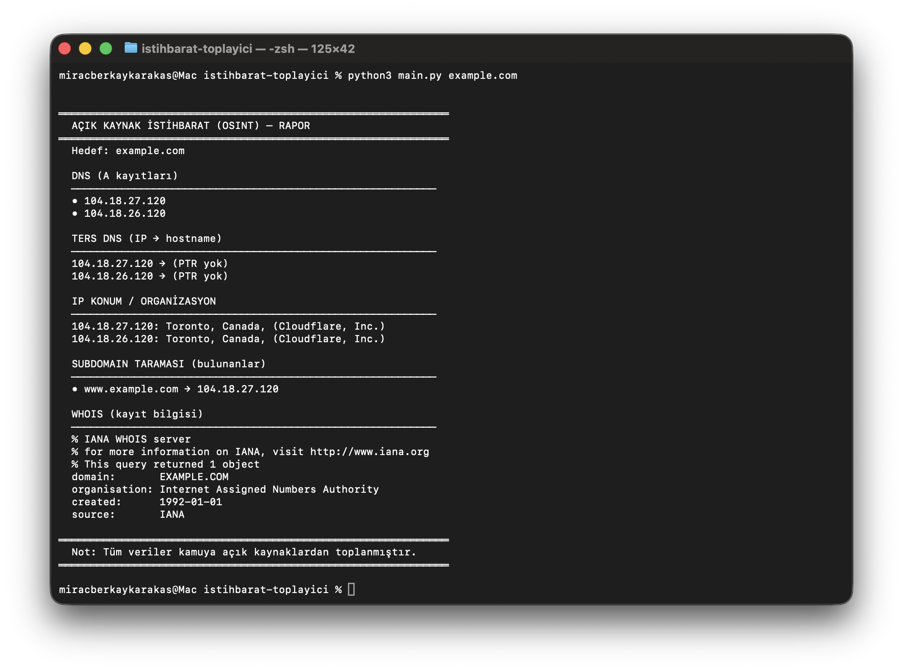
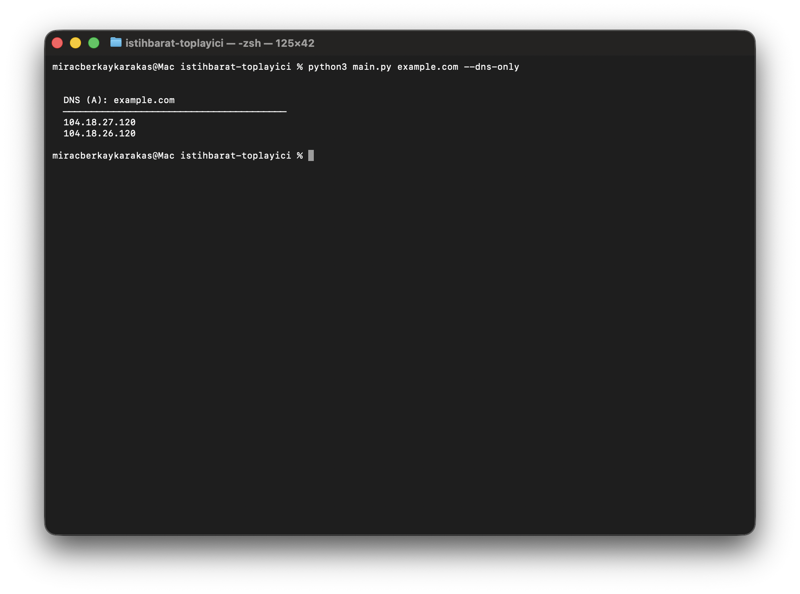
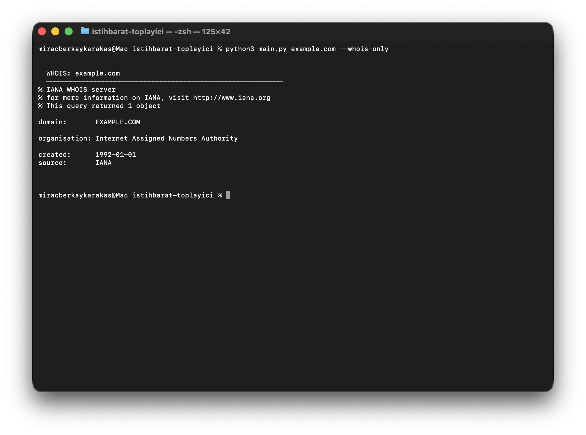
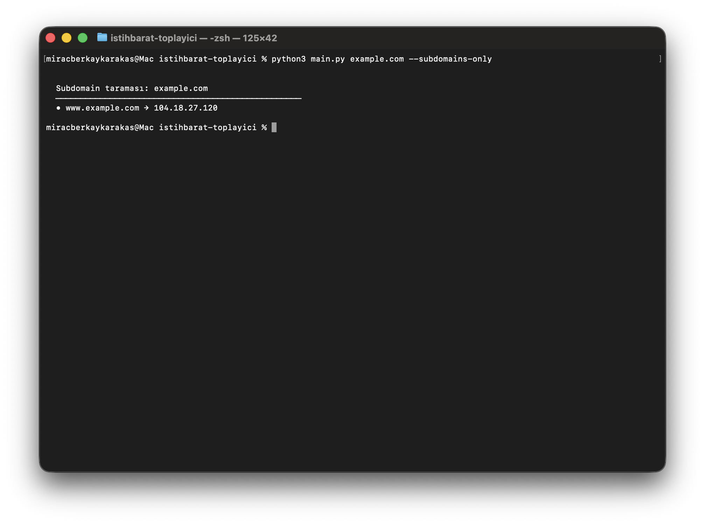
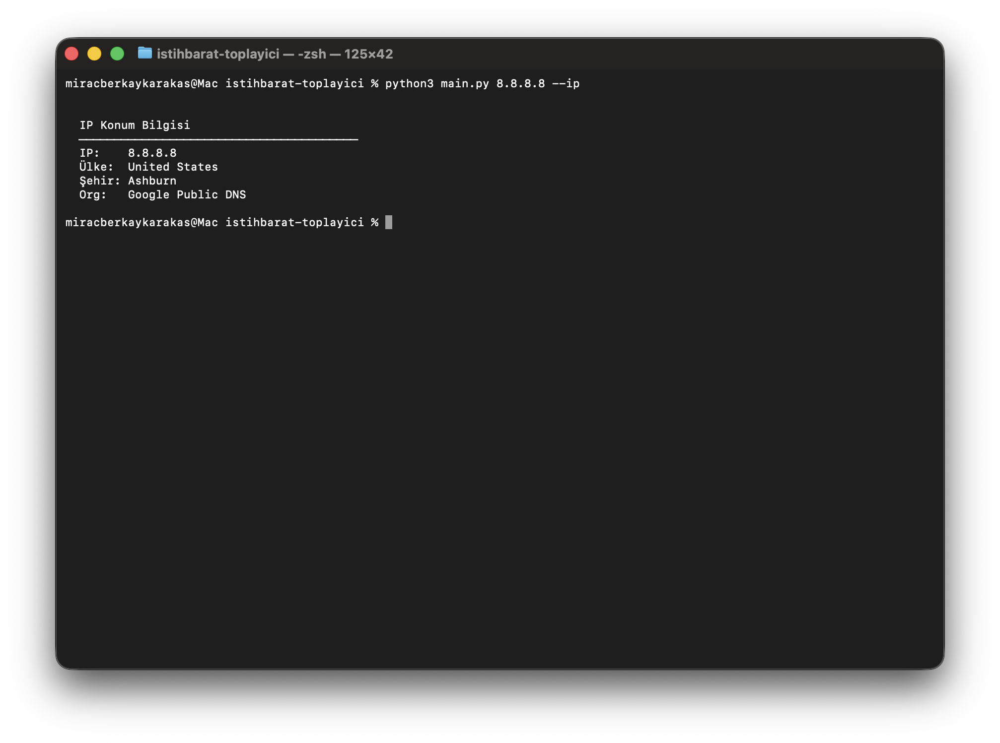
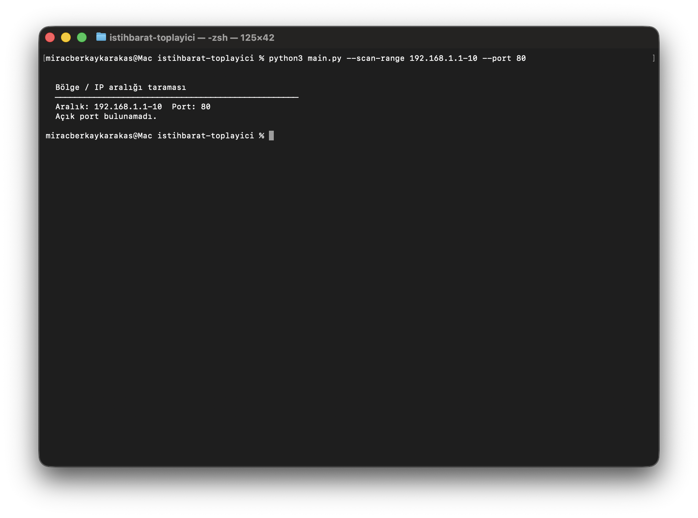

# Açık Kaynak İstihbarat (OSINT) Toplama Aracı

**Geliştiren:** Miraç Berkay Karakaş

İnternetteki **kamuya açık** bilgileri toplayan eğitim amaçlı araç. Domain veya URL için WHOIS, DNS (A kaydı) ve IP konum/organizasyon bilgisi sunar.

---

## ⚠️ Önemli

- Sadece **açık ve yasal** kaynaklar kullanılır (WHOIS, DNS, ücretsiz IP API).
- Eğitim ve güvenlik araştırması amaçlıdır; kişisel veri toplama veya kötüye kullanım için kullanılmamalıdır.

---

## Özellikler

| Özellik | Açıklama |
|--------|----------|
| **DNS (A)** | Domain’in çözümlendiği IP adresleri |
| **WHOIS** | Kayıt bilgisi (sistem `whois` komutu) |
| **IP konum** | IP için ülke, şehir, organizasyon (ip-api.com) |
| **Ters DNS (PTR)** | IP → hostname (aynı IP'deki hizmet bilgisi) |
| **Subdomain tarama** | Yaygın subdomain'leri dener (www, mail, api, dev vb.) |
| **Bölge / IP aralığı tarama** | Belirli bir IP aralığında açık port tarar |

## Gereksinimler

- **Python 3.8+**
- Ek paket yok (sadece stdlib)
- **WHOIS:** macOS/Linux’ta `whois` komutu (Windows’ta opsiyonel; WHOIS atlanır)

---

## Kullanım

```bash
cd istihbarat-toplayici

# Tam rapor (DNS + ters DNS + WHOIS + IP konum + subdomain taraması)
python3 main.py example.com
python3 main.py https://example.com

# Subdomain taraması olmadan
python3 main.py example.com --no-subdomains

# Sadece WHOIS
python3 main.py example.com --whois-only

# Sadece DNS (IP listesi)
python3 main.py example.com --dns-only

# Sadece subdomain taraması
python3 main.py example.com --subdomains-only

# Hedef bir IP ise (sadece konum bilgisi)
python3 main.py 8.8.8.8 --ip

# Bölge / IP aralığı taraması (açık port)
python3 main.py --scan-range 192.168.1.1-20 --port 80
python3 main.py --scan-range 10.0.0.0/28 -p 443
```

---

## Proje yapısı

```
istihbarat-toplayici/
├── main.py           # CLI ve rapor
├── osint.py          # WHOIS, DNS, IP konum, subdomain, bölge tarama
├── requirements.txt
├── ORNEK_KOMUTLAR.md # Ekran görüntüsü için örnek komutlar
├── 01-tam-rapor.png  # Örnek çıktı görselleri
├── 02-dns-only.png
├── ...
└── README.md
```

---

## Örnek çıktı

### 1. Tam rapor (`python3 main.py example.com`)



### 2. Sadece DNS (`--dns-only`)



### 3. Sadece WHOIS (`--whois-only`)



### 4. Sadece subdomain taraması (`--subdomains-only`)



### 5. IP konum bilgisi (`8.8.8.8 --ip`)



### 6. Bölge / IP aralığı taraması (`--scan-range`)



---

## Python içinde kullanım

```python
from osint import (
    collect_all,
    dns_lookup,
    whois_lookup,
    ip_geolocation,
    reverse_dns,
    subdomain_scan,
    ip_range_scan,
)

# Tam toplama (subdomain + ters DNS dahil)
data = collect_all("example.com")
print(data["dns"]["ips"])
print(data["reverse_dns"])
print(data["subdomains"]["found"])
print(data["whois"]["raw"])

# Tek tek
dns = dns_lookup("example.com")
geo = ip_geolocation("8.8.8.8")
sub = subdomain_scan("example.com")
open_ips = ip_range_scan("192.168.1.1-20", port=80)
```

---

## Lisans

MIT – eğitim ve kişisel kullanım için serbesttir.

*Geliştiren: **Miraç Berkay Karakaş***
